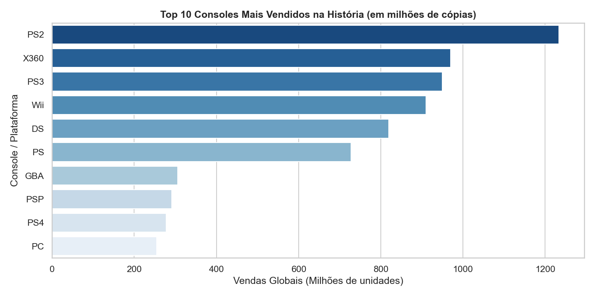
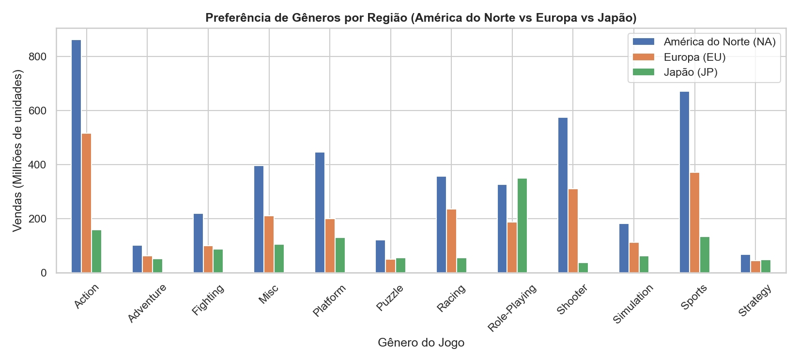

# 📊 Análise Exploratória de Dados (EDA) - Vendas Globais de Video Games

Este repositório contém um projeto de **Análise Exploratória de Dados (EDA)** em Python utilizando o dataset histórico de **Vendas Globais de Video Games (VGSales)**.

---

## 🎯 Objetivos de Negócio
- Investigar a evolução de vendas da indústria de games ao longo das décadas.
- Identificar as **plataformas de maior sucesso comercial da história**.
- Analisar a **diferença comportamental e cultural de consumo** entre as regiões: América do Norte, Europa e Japão.

---

## 📈 Visualização dos Gráficos

### 🎮 1. Top 10 Consoles Mais Vendidos na História


> **Insight:** O **PlayStation 2 (PS2)** lidera a história como a plataforma de maior faturamento acumulado em vendas de softwares (mais de 1.230 milhões de cópias), seguido de perto pelo **Xbox 360** e **PlayStation 3**.

---

### 🌏 2. Preferência de Gêneros por Região


> **Insight:** Enquanto a **América do Norte (NA)** e a **Europa (EU)** consomem massivamente jogos de **Ação (Action)** e **Esportes (Sports)**, o **Japão (JP)** apresenta dominância marcante do gênero **RPG (Role-Playing)**.

---

## 🛠️ Tecnologias & Ferramentas
- **Linguagem**: Python 3
- **Bibliotecas de Manipulação**: `Pandas`, `NumPy`
- **Bibliotecas de Visualização**: `Matplotlib`, `Seaborn`
- **Ambiente**: Google Colab / Jupyter Notebook / VSCode

---

## 📂 Estrutura do Repositório

```text
vgsales-data-analysis/
├── README.md                               <-- Apresentação com gráficos incorporados
├── VGSales_Exploratory_Data_Analysis.ipynb <-- Notebook completo formatado
├── vgsales_analysis.py                     <-- Script Python executável
├── top_consoles.png                        <-- Imagem do gráfico 1
└── generos_regiao.png                      <-- Imagem do gráfico 2
```

---

## 🚀 Como Executar Localmente

```bash
# 1. Clonar o repositório
git clone https://github.com/victorauso/vgsales-data-analysis.git

# 2. Instalar dependências
pip install pandas numpy matplotlib seaborn

# 3. Executar o script de análise
python vgsales_analysis.py
```

---

## 📬 Contato
- **Victor Oliveira**
- 💼 **LinkedIn:** [linkedin.com/in/victor-oliveira](https://www.linkedin.com/in/victor-oliveira)
- ✉️ **Email:** victorauso@gmail.com
